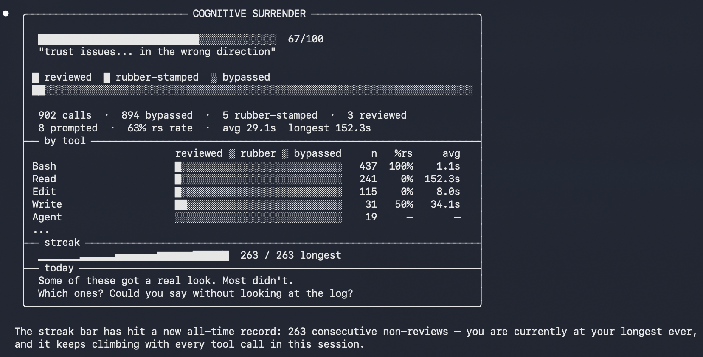

# Cognitive Surrender

> *Are you reviewing Claude Code's tool calls, or just pressing [y]?*

A CLI tool that hooks into Claude Code and measures how quickly you approve permission prompts. It classifies each approval as **reviewed**, **rubber-stamped** (approved too fast), or **bypassed** (settings skipped the prompt entirely). The goal isn't to shame — it's to surface data that sparks honest conversations about whether human review adds value in AI-assisted workflows.

## Install

```bash
npm install -g cognitive-surrender
cd $(npm root -g)/cognitive-surrender/hook && cargo build --release
cs install      # adds hooks to ~/.claude/settings.json
```

Requires Node.js >= 22 and a Rust toolchain. Restart Claude Code after installing — the hooks fire silently on every tool call.

## Commands

```bash
cs stats              # Surrender rate and tool breakdown (last 7 days)
cs stats --days 30    # Longer window
cs streak             # Current and longest rubber-stamp streak
cs challenge          # Provocative summary of today's approvals
cs export             # Export stats as CSV, JSON, or Markdown
cs uninstall          # Remove hooks from settings.json
```

Output uses gradient bars, sparklines, and flame indicators — no extra dependencies, chalk only.



## How it works

Three categories of tool call, measured differently:

1. **Permission-prompted** — Claude Code shows you a dialog. The time between the prompt appearing and your response is your *decision time*. Under the threshold for that tool's complexity = rubber-stamped. This covers both regular tools (`Bash`, `Edit`, `Write`) via `PermissionRequest` → `PreToolUse`, and meta-tools (`AskUserQuestion`, `ExitPlanMode`, `Skill`) via `PermissionRequest` → `PostToolUse`.
2. **Bypassed by settings** — your `settings.json`, `settings.local.json`, or `managed-settings.json` auto-approved without asking. You were never prompted. Logged as bypassed, with attribution to the specific allow rule that matched.

Stats show the full picture: *"Of 200 tool calls, 150 were bypassed. Of the 50 that asked you, you rubber-stamped 40."*

## Status line

The status line (shown in Claude Code's bottom bar) reports your surrender rate as:

```
○ session 0/0 reviewed  258 auto  │  ○ today 0/0 reviewed  262 auto  (99% surrender)
```

The **surrender rate** counts bypasses as surrender — `(rubber_stamped + bypassed) / total`. A session where every prompt was auto-approved shows 100%, not 0%. The dot indicates severity: `●` < 30%, `◐` 30–60%, `○` > 60%.

## Scoring

**Complexity** is computed per tool call:
- Tool type: `Bash` (0.85), `Write` (0.75), `MultiEdit` (0.70), `Edit` (0.65), `Read` (0.10), `Glob/Grep/LS` (0.05)
- Input length: +0.10 for >500 chars, +0.10 for >2000
- Code content: +0.05 if the input contains code keywords

**Threshold** = `1000ms + (complexity × 5000ms)` — the minimum time you'd need to actually read what you're approving.

**Cognitive Surrender Index (CSI)** = weighted rubber-stamp rate (0–100). Recent decisions and complex approvals weigh more. 100 = total autopilot.

## Data

Stored locally in `~/.cognitive-surrender/decisions/YYYY-MM-DD.jsonl`. One file per day, one JSON object per line. Nothing leaves your machine.

## The point

This tool doesn't answer whether rubber-stamping is *bad*. Maybe you trust the model. Maybe low-risk auto-approvals are fine. Maybe you're faster at reviewing than you think. The data lets you have that conversation with your team from a factual baseline instead of a vibe.

The question worth asking: *are you slowing things down, or catching things others would miss?*
